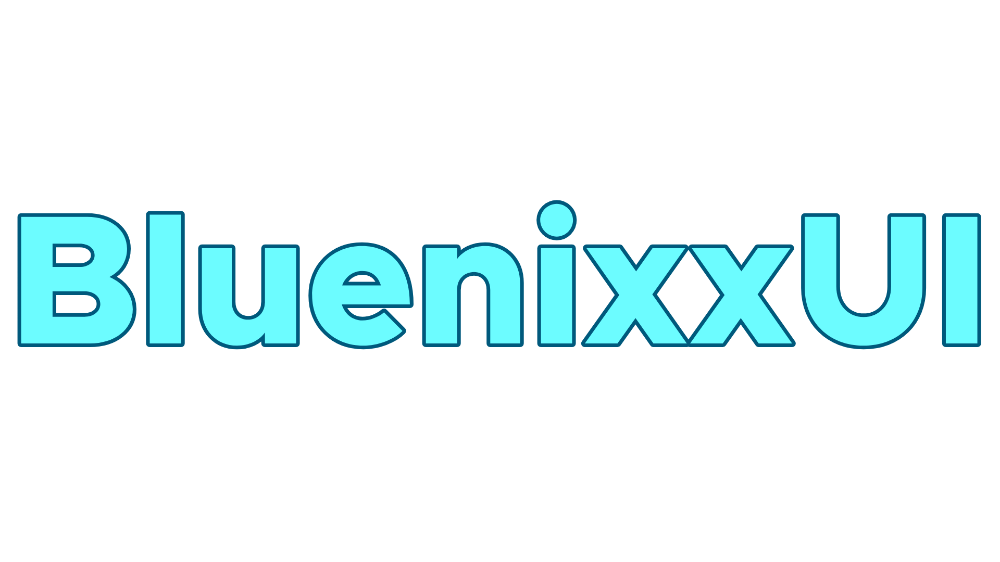

# Bluenixx build guide



---

Create directory for bluenixx
```
mkdir ~/bluenixx
cd ~/bluenixx
```
```
repo init -u https://github.com/Bluenixx/android_manifest.git -b lineage-23.2
repo sync
```

---

Bluenixx flags

```
BLUENIXX_MAINTAINER := Unknown # Yourname
```
```
LINEAGE_BUILDTYPE := OFFICIAL # UNOFFICIAL
```
```
WITH_GMS_COMMS_SUITE := true # false
```

---

Build
```
lunch lineage_$codename-bp4a-user # or userdebug
```

```
m bacon
```

---

if you don't want Dolby
```
rm -rf ~/bluenixx/vendor/sony
```
Dolby commits common references

https://github.com/LineageOS/android_device_motorola_sm6375-common/commit/a6c02664f717de3a0bec1f7e52aa91f2aadac61c

https://github.com/LineageOS/android_device_motorola_sm6375-common/commit/93ba95f5f492b3b37fc2435787a8597a453e9bce

https://github.com/LineageOS/android_device_motorola_sm6375-common/commit/2be55f6ea644f9aef61ac019341f9c5ab7ae38a6

https://github.com/LineageOS/android_device_motorola_sm6375-common/commit/63b22310abce5818317edc11172141254a7ef9e3

https://github.com/LineageOS/android_device_motorola_sm6375-common/commit/90dbe306eb1597dc5e995c81e2a09db1805b0f7a

https://github.com/LineageOS/android_device_motorola_sm6375-common/commit/699c522b59d7bbfbf8c74c0b463f88d9cfb7bd0c

